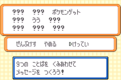
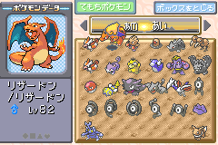

# Japanese LeafGreen ACE Setup
This method is LeafGreen only as it uses a trade Pokémon that is version-exclusive, if you want a method that works for FireRed, check out [this English guide](https://github.com/it-is-final/jpn-frlg-helper/blob/main/docs/ace-setup.md) I made or [this video](https://www.youtube.com/watch?v=i9d4AyI2l1A) if you can understand written Japanese very well.

If you are looking for a guide for western releases of FRLG, Papa Jefe has made a [video guide]((https://www.youtube.com/watch?v=8d2kd2_iVps)) or you can also watch this [video](https://www.youtube.com/watch?v=yVhK4pLC9ac) by merrp that uses a slightly different method (read the description for the details!).

This guide uses the method mentioned for FireRed as its basis but streamlines the steps and removes the manipulation/luck required to obtain the donor Pokémon through using a trade Pokémon.

## Preparation
You will need:
- Mail corruption already activated on your save (you can watch [this video guide](https://www.youtube.com/watch?v=yVhK4pLC9ac) to learn how to activate it)
- Have the ニドくん (Nidoran♂) trade available
- Have at least 36 Retro Mail in the bag
- Have at least 1 Rare Candy in the bag
- Box 3, Slot 1 is empty

> [!NOTE]
> If you already have the ニドくん (Nidoran♂) trade Pokémon, make sure it has not been evolved into a Nidoking and its experience must an even value less than or equal to 61536.
> If it is still a Nidoran♂, make sure its level is less than level 41 so that it has been evolved to be a Nidorino by level 41.
> The trade Pokémon has a lonely nature and the OT’s trainer ID should be 63184.

> [!NOTE]
> If you have 36 or more Rare Candy, you can skip the Rare Candy cloning step but you could also use the opportunity to top up on your Rare Candy ;).

## Instructions
1. Go to the Underground Pass entrance on Route 5, and trade a Nidoran♀ with the girl.


2. Give each member of your party (except for first member) Retro Mail, the message can be anything.
3. Give the first member of the party Rare Candy
4. Then attempt to give the first member of the party Retro Mail, when you see the mail message screen it should look like this


5. Press `START` and confirm the mail, when you do this you notice that the party member is still holding Rare Candy but the Rare Candy amount in the bag goes up by one while the Retro Mail in the bag goes down by one
6. Repeat steps 4 and 5 until you have at least 36 Rare Candy in the bag
7. Once you are done with the Rare Candy cloning, remove the Rare Candy from the first member of the party
8. Give ニドくん Rare Candy until he is at level 41, make sure to evolve him to a Nidorino!
9. Once ニドくん is at level 41, go to the daycare in Route 5 (or the one in the Sevii Islands if your save is extra completed)
    - At this point, ニドくん’s experience should be 61450.
10. Deposit ニドくん in the daycare and walk 86 steps, ending your last step in front of the daycare man
11. Withdraw ニドくん from the daycare, his experience should be 61536


12. Place ニドくん into Box 3, Slot 1, and withdraw another box Pokémon to be the sixth party member.


13. Give Retro Mail to the sixth party member, and write the following message to the mail
    - ポケモンゲット as the 3rd word
    - うう as the 5th word
    - All other words left untouched



14. Confirm the mail, then check the Box 3 again, a glitch Pokémon should take the place of ニドくん.


15. Move four party members into the boxes with the last party member to move still held by the orange hand (can be activated by pressing SELECT)
16. Rename Boxes 1-5 to the following
    ```
    Box  1: リ び ‥ o く _ ゼ n	[リび‥oく ゼn]
    Box  2: _ ‥ t ま _ 1 t ほ	[ ‥tま 1tほ]
    Box  3: ぁ m _ _ あ い	[ぁm  あい]
    Box  4: ア B ぢ い い N	[アBぢいいN]
    Box  5: O	[O]
    ```
17. With a Pokémon still in the orange hand, go back to Box 3, and swap the glitch Pokémon with the Pokémon then back again



18. Exit out of Move Pokémon mode then enter deposit mode, in the third party slot there should be another glitch Pokémon in party slot 3
    - You should probably place it somewhere in the boxes


That is it, you have setup ACE in Japanese LeafGreen!
Since there isn’t much ACE codes written for this setup (by English speaking people that is), you will have to check the other half of [this video](https://www.youtube.com/watch?v=i9d4AyI2l1A) by a Japanese glitcher to use the ACE environment that Japanese glitchers use (another tip search ‘任意コード実行 ポケモン ファイアレッド ･リーフグリーン’ on the internet and look at results from the last 12 months).

Sidenote, you probably don’t want to keep the initial glitch Pokémon (created from mail corruption) in the boxes, to remove it please do the following:

1. Place the glitch Pokémon in the party (using the orange hand)
2. Exit the PC, then go to the party menu
3. Move the glitch Pokémon to the first party slot
4. Go back to the PC and enter deposit mode
5. Release the Pokémon by selecting the Pokémon then select release and confirm